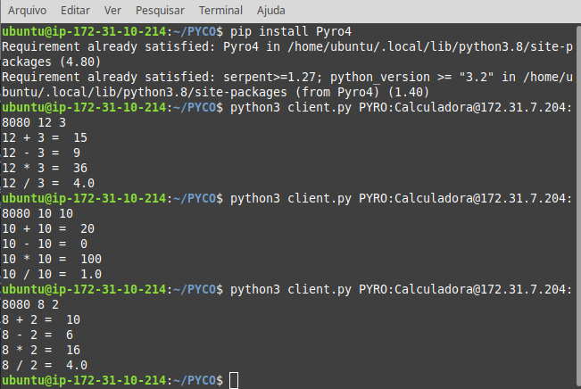

# RMI-Calculator
A simple Calculator Web Service that implements Remote Method Invocation, using an URI to identify objects through the network and the Pyro4 server to exposes it.

### Server side:

```
Usage: ./server
   or: python3 server.py
```


### Client side:

```shell
Usage: ./client.py SERVER-URI N1 N2
   or: python3 client.py SERVER_URI N1 N2       
```



The server responded:


